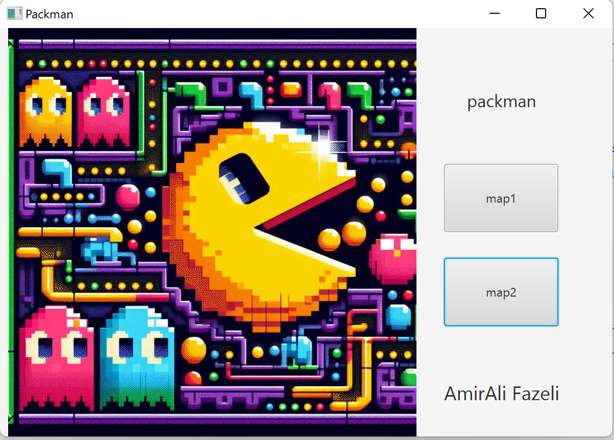
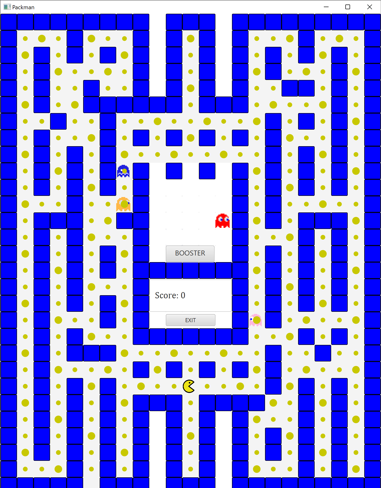
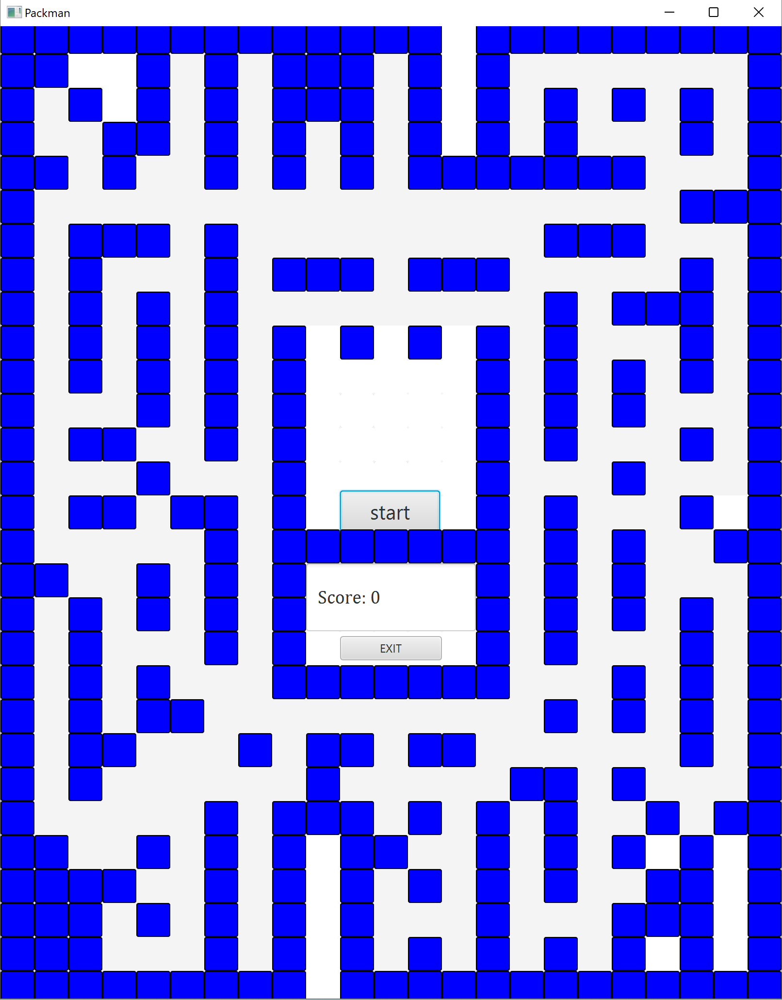
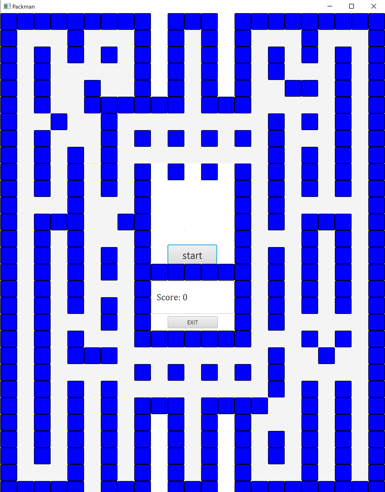
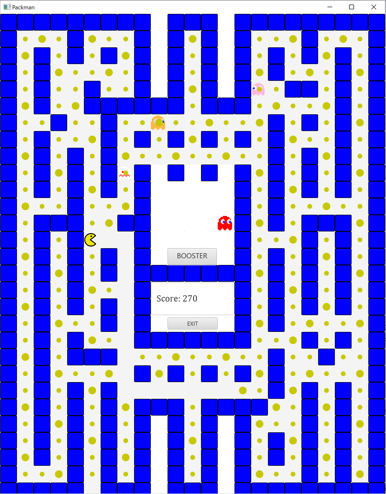
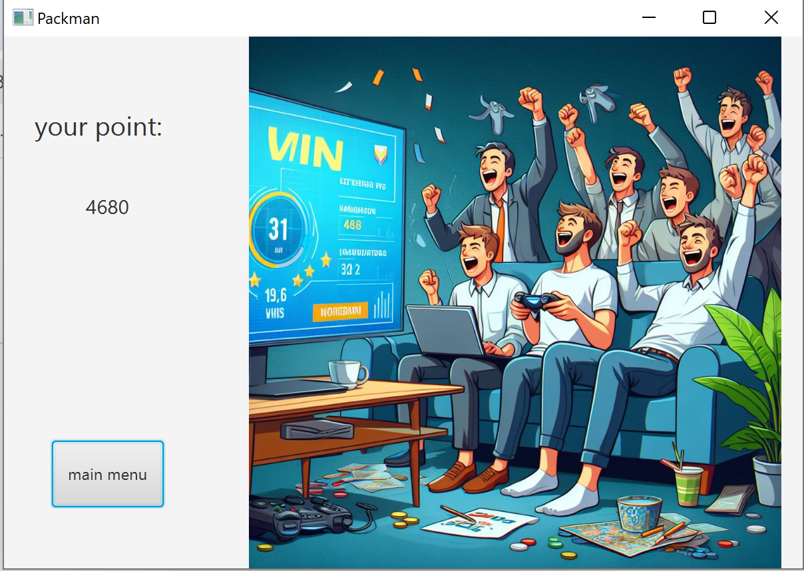
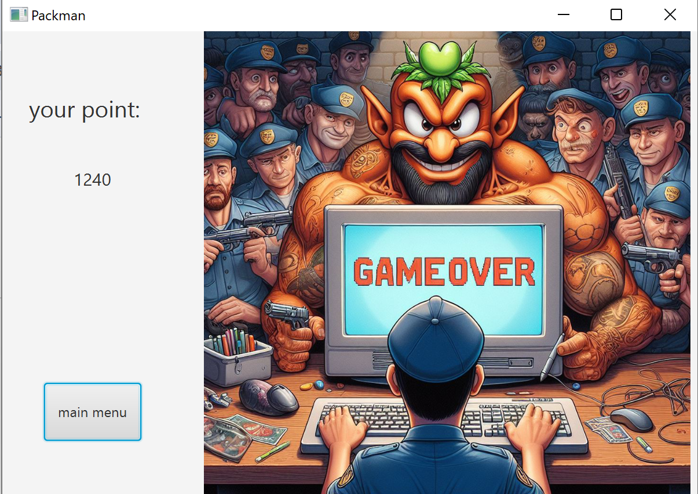

# Pac-Man Game 🕹️

A classic 2D Pac-Man game implemented in Java using **IntelliJ IDEA**. This project features fully functional gameplay mechanics, ghost AI, score tracking, and multiple maps.

---

## 📸 Screenshots & Gameplay

Here is a preview of the game in action. You can see the start screen, active gameplay on different maps, and the game status (Scoring, Won, and Game Over).

<p align="center">
  
  
</p>

<p align="center">
  
  
</p>

<p align="center">
  
  
  
</p>
---

## ✨ Features

- **Classic Gameplay:** Smooth movement, dot-eating mechanics, and classic controls.
- **Multiple Maps:** Features distinct maze layouts (`عکس نقشه1` and `عکس نقشه 2`).
- **Dynamic Screens:** Custom graphical screens for Game Menu, Scoring, Victory (`won.png`), and Game Over (`gameover.png`).
- **Score System:** Tracks player points in real-time as you consume dots.

---

## 🚀 How to Run

### Prerequisites
Make sure you have the following installed on your system:
- **Java Development Kit (JDK 17 or higher)**
- **IntelliJ IDEA** (or any other Java IDE)

### Execution Steps
1. Clone the repository to your local machine:
   ```bash
   git clone [https://github.com/amiralitw9/PacMan.git](https://github.com/amiralitw9/PacMan.git)
